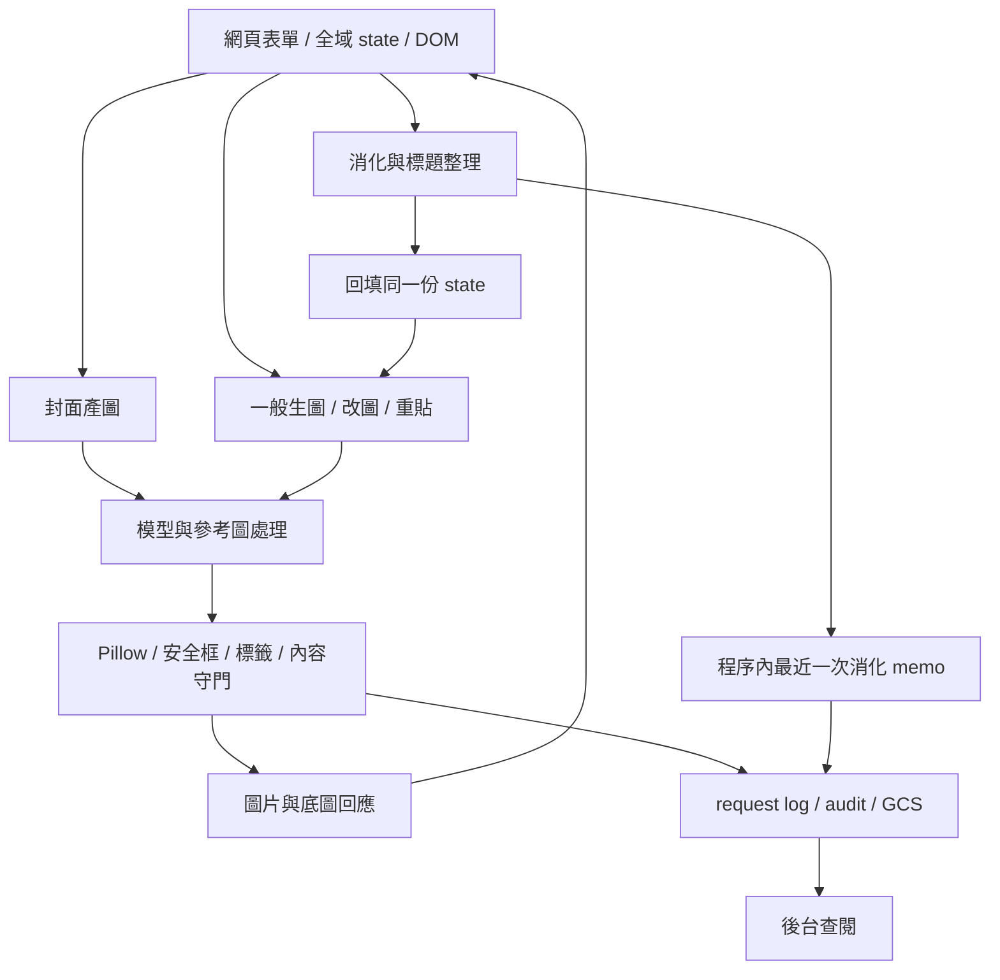
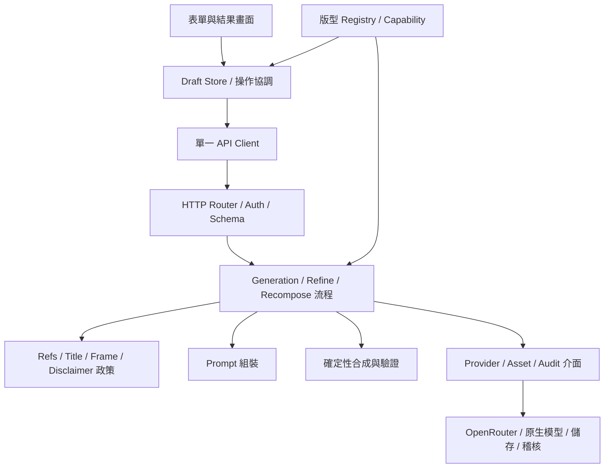
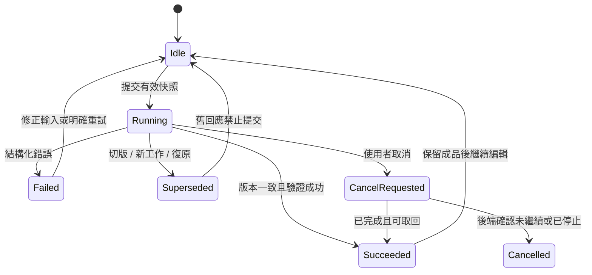

# 網頁版底層架構重整、聯動模組化與全面體檢計畫書

版本：評估稿 v1.0｜日期：2026-09-27｜對象：產品負責人、維護工程師、測試與部署人員

評估基準：分支 `codex/reconstruct0927`，commit `0d38ecdc0ddeb1cc09c62b6a7724b1b325f30f1e`，產品版本 `260927-01`。

本次交付為程式現況評估、離線重現證據與分階段實施計畫。未修改產品執行碼、未部署，也未呼叫付費 AI。以下工期、容量門檻與目標架構均為提案；不代表已實施。

## 1. 評估結論與建議決策

**建議採「保留現有產品行為、逐段替換的模組化單體」：先修正操作生命週期、稽核關聯及部署／驗證缺口，再抽離共用政策與各產圖流程。**

目前最主要的技術債，不是檔案太長本身，而是同一項業務規則需要前端狀態、表單、請求欄位、後端分支、合成步驟及稽核紀錄同時配合。新增一個版型或選項時，開發者必須記住整條路徑；漏一處，就會形成「按鈕有變、實際輸出沒變」或「圖變了、紀錄仍是舊的」問題。

本輪確認 **7 項缺陷／缺口**：6 項以實際函式及替身依賴離線重現，1 項以現存檔案名稱與 Docker 規則靜態確認。這些不等於正式站已發生 7 起事故。另列 8 項尚待驗證的風險，避免把推論寫成 BUG。既有 B112 已有修正碼，本計畫不將其重新列為新問題。

建議優先順序：

1. **P0：部署材料排除機密備份**，確認既有映像是否受影響。
2. **P1：操作一致性**，統一生成、改圖、重貼、復原的身分與版本，阻止重複送單及舊回應覆蓋。
3. **P1：驗證與稽核一致性**，修正 token 同源判斷、同步驗證阻塞，以及同一使用者多稿件的配對。
4. **P2：單一政策來源與流程拆分**，先抽介面與純計算，再拆 router 與畫面檔案。
5. **P2：測試、部署、觀測成為日常護欄**，用證據決定是否需要持久任務與分離 worker。

首波不以更換前端框架、微服務化、通用圖層 DSL 或全面改 async 為目標。這些措施無法直接解決本輪重現的狀態競態，且會擴大視覺與行為回歸範圍。

## 2. 範圍、方法與可信度

### 2.1 本輪涵蓋

- 網頁入口：`index.html`、`app.js`、`hybrid.html`、`hybrid.js`、`static/auth-bootstrap.js`。
- 後端：`main.py` 的認證、消化、圖片生成、改圖、重貼、十點／YT／直標與稽核流程。
- 共用模組：`editor_formats.py`、`creativity.py`、`news_prompt.py`、`compose.py`、安全框／內容守門、附圖與查圖相關路徑。
- 持久化與營運：request log、audit archive、GCS、admin、Docker／啟動方式、測試與開發環境。
- LINE 僅納入「共用後端契約不能被網頁重構破壞」的相容性範圍；本輪未進行正式 webhook 實測。

### 2.2 證據來源

先使用 codebase-memory-mcp 的架構、符號搜尋與呼叫追蹤，追出前端操作及稽核呼叫鏈。圖譜回傳的部分 snippet 行號與現行檔案不一致；重新索引後仍有偏移，因此**圖譜只用於發現關係，所有本報告引用位置與程式結論均回到工作目錄核對**。規模統計使用現行檔案與 Python AST，未以舊文件行數當現況。

閱讀並對照 `MASTER-列管清單.md`、`TODO.md` 的模組化段落、技術交接、產品提案、既有附圖／創意模組化計畫及 B112 修正報告。`MASTER` 仍是唯一狀態帳本；本文件的 `AUD-*` 是評估索引，不另建一套完成狀態。

### 2.3 明確限制

- 沒有登入正式站、讀取正式帳號資料、檢查現役容器映像或發出付費生成請求。
- 前端重現執行完整 `app.js`，以 Node VM 提供最小 DOM 與網路替身；不是完整瀏覽器 E2E，也不驗證視覺呈現。
- 後端重現執行實際函式；同步驗證阻塞使用 100ms 的假驗證 I/O，證明阻塞機制，不代表線上實際延遲。
- 全套測試採現有可用 Python 3.11.15；專案宣告 Python 3.14。目前可用環境的 FastAPI 0.133.1、OpenAI SDK 2.24.0、Pillow 12.2.0 也低於專案宣告下限，因此這是替代環境的離線回歸結果，不能冒充 lockfile／正式容器驗證。
- 本輪未執行第三方依賴 CVE 掃描、滲透測試或正式災難復原；其結果不可由單元測試推定。
- 「全面體檢」指涵蓋主要層次及交互風險，無法據此保證沒有其他 BUG；付費模型畫質、正式負載、多執行個體儲存與瀏覽器實際流程仍有待驗矩陣。

## 3. 現況架構與健康度

### 3.1 實測規模

以下為包含空行的實體行數，不是複雜度或品質分數。

| 檔案 | 行數 | 主要責任 | 評估 |
|---|---:|---|---|
| `app.js` | 4,231 | 模板、版型表、全域 state、DOM、請求、生成／改圖／復原 | 操作與狀態責任高度集中 |
| `main.py` | 9,371 | 202 個函式，模型設定、schema、政策、流程、HTTP、稽核 | 適合先拆流程協調與外部依賴 |
| `compose.py` | 4,464 | 137 個函式，字型、版位、底圖、標題、標籤、合成 | 有可保留的確定性能力，應依圖像職責拆分 |
| `editor_formats.py` | 2,723 | 56 個函式，版型、能力、提示詞與設計參數 | 已有單一能力矩陣，前端尚未完全直接消費 |
| `news_prompt.py` | 933 | Prompt 規則及組裝 | 與前端副本以 parity 保護，仍有同步成本 |
| `index.html` | 1,142 | 表單、樣式、inline event handlers | 與全域函式及 DOM ID 強耦合 |
| `hybrid.js` | 522 | SVG 排版、背景生成、匯出 | 另一路前端生命週期，需保留獨立驗收 |

現有 145 個 `test_*.py` 模組；其中 44 個提及／讀取前端檔案，**不代表這 44 個全都只有字串檢查**，部分已有 Node 執行測試。測試數量可觀，但操作交錯的本輪重現案例仍未被攔住。

另有既知 B71：`tests/test_b71_simplified_char_gap_20260916.py:46` 將簡體「骗」未被攔截標記為 expected failure。這項已列管，不算本輪七項；即使整套顯示 OK，也必須將此已知失敗個別呈現。

最大的後端函式包括 `editor_yt_cover` 416 行、`generate` 381 行、`_cover_ai` 285 行、`editor_cover` 214 行。拆分目標應是降低同一次修改需要理解的規則數，不以把函式切成許多轉呼叫為驗收。

### 3.2 目前的資料流



### 3.3 可以沿用的資產

- `Capability`、`FORMAT_CAPABILITIES`、`format_catalogue()` 已存在，8 個正式版型鍵及別名有檢查；不必從零建立註冊表。
- `creativity.py` 已收斂變化池、seed 與件數機制；應保留 RNG 消耗順序及既有 pin。
- `news_prompt.py`、安全區規格與共用成品處理已有明確責任，可以作為抽離 seam（可替換位置）。
- 現有 input validation、fail-closed API key、Clerk domain allowlist、admin escaping、圖片可讀性檢查、消化 deadline、NDJSON 心跳、ContextVar 及 fallback 路徑有防護價值。
- B97／B98 已對「restamp 對 restamp」做序號保護，B112 已修正封面實際 prompt 留存。新的統一生命週期應吸收這些修正，不把它們刪掉重做。

### 3.4 健康度判斷

| 面向 | 現況判斷 | 主要依據 | 目標 |
|---|---|---|---|
| 功能政策 | 中度風險 | 能力矩陣存在，但標題、附圖、frame 與 UI 仍分散 | 請求前產生唯一有效計畫 |
| 操作一致性 | 高風險 | AUD-02／03／05 可重現 | 所有異步操作共用 revision 與 operation ID |
| 稽核可追溯 | 高風險 | AUD-04 使用者時間窗配對 | 原文、digest、prompt、成品有顯式關聯 |
| 認證與部署 | 優先修補 | AUD-01／06／07 | 機密不入映像、token 精確同源、I/O 不堵事件迴圈 |
| 測試 | 有基礎但不完整 | 既有大量測試，互動交錯仍漏 | 行為、契約、並行與視覺分層驗證 |
| 擴充成本 | 持續上升 | 新規則需要多個分支同步 | 新版型以描述＋特有策略接入 |
| 營運可驗證性 | 待補證 | 手動部署，現行本機 Python 與宣告版本不同 | 可重建環境、CI、部署前 smoke 與回滾演練 |

## 4. 已確認的問題與修正規格

優先級定義：P0＝應在下一次本地建置／部署前處理；P1＝首波可靠性工作；P2＝隨模組遷移完成。P0 不表示已證實外洩。下列名稱、行號均以本次基準版本為準。

### AUD-01｜P0｜本地 Docker build context 未排除環境備份

- **證據**：`.dockerignore` 排除 `.env`，沒有排除 `.env.bak-*`；根目錄實際存在 1 個此類備份；`Dockerfile:22` 使用 `COPY . .`。
- **成立條件**：直接使用包含該備份的本地工作目錄作為 Docker context，且上游沒有另外排除該檔。
- **結果**：該備份可進入建置 context 及映像。未讀備份內容、未建置映像，不能斷言正式站已含機密。
- **修正**：排除 `.env*`，如需樣板則明列不含機密的 `.env.example` 例外；改成明確的產品檔案 COPY 清單；部署前檢查 context／最終映像檔案清單。Cloud Build／其他部署來源各自核對上傳規則。
- **驗收**：用假機密檔建置本地測試映像，context 與所有 image layers 均不得含該檔；既有映像調查若證實包含真實憑證，再依實際暴露範圍輪替。
- **外部依據**：[Docker build context 官方文件](https://docs.docker.com/build/concepts/context/) 說明 `.dockerignore` 控制送入的 context；`.gitignore` 不能代替本地 Docker 的排除規則。

### AUD-02｜P1｜版型切換後，舊改圖請求仍可回填

- **位置**：`app.js:1191` `setEditorFormat()`、`:3934` `handleRefine()`，以及生成回寫路徑 `:2603`、`:2890`、`:3255`。
- **重現**：以 A 成品開始改圖 → 切版清空 `refineSource` → A 請求完成 → `handleRefine()` 不檢查操作版本，重新寫入 A 的結果。
- **已證明**：改圖路徑回填；其他生成路徑目前為同型靜態風險，應逐一補 E2E，不冒稱全部已實跑。
- **影響**：新版型畫面顯示舊圖，下載名稱或後續重貼可能使用新表單與舊成品的混合資料。單純增加 fetch abort 不足以保證結果安全。
- **修正**：送出時保存 `documentId + revision + operationId` 及完整參數快照；任何回應提交前核對；切版、換角色及新作業令舊操作失效。所有 success／error／finally 都必須檢查身分，避免舊 finally 解鎖新作業。
- **驗收**：延遲 A，切版並完成 B，再放回 A；B 圖、B 狀態、B 按鈕及訊息保持一致。

### AUD-03｜P1｜改圖快捷鍵可重複送出，且舊回應覆蓋新回應

- **位置**：`app.js:3927` `handleRefineKeydown()`、`:3934` `handleRefine()`。
- **重現**：第一次改圖待回應時，再觸發 Ctrl／Cmd+Enter；程式只停用按鈕，函式入口沒有 in-flight 守衛，實際送出兩個請求。第二個先完成、第一個後完成，最終來源變成第一個的舊結果。
- **影響**：可能重複付費、復原堆疊順序錯誤、使用者較新的操作被覆蓋。測試只使用假 fetch，沒有產生費用。
- **修正**：UI 事件及快捷鍵共用 operation coordinator；同一份成品同一時間最多一個 mutating operation。後端加冪等識別，網路重送與「我要重新生成」使用不同語意。
- **驗收**：同一個 operation 連按十次只送一次；以相同 idempotency key 重送不再調 provider；使用者真正重新生成則取得新的 operation ID 與 seed。

### AUD-04｜P1｜同一使用者多稿件會使稽核原文錯配

- **位置**：`main.py:537` `_remember_digest()`、`:550` `_recall_digest()`、`:732` `_enrich_archive_fields()`。
- **重現**：相同 `user_id` 消化稿 A，再消化稿 B，接著歸檔 A 的 image prompt、原文字段為空；實際補上 B 原文。函式重現輸出 `expected_news=article-A / actual_news=article-B`。
- **影響**：後台以為 A 成品源自 B；失敗追查與品質統計不可信。程序內 memo 在多執行個體／重啟時還可能失聯，此部分為部署風險，尚未實測。
- **修正**：引入 `digestId`／`jobId`、原文摘要雜湊與 owner，後續生圖明確帶回；禁止僅按 user＋時間猜配對。過渡期可用受驗證的明確內容快照；找不到來源就標 `unlinked`，不補別稿。
- **驗收**：同使用者兩分頁交錯 20 次、不同使用者並行、跨執行個體及重啟都不錯配；未關聯紀錄顯示未知，不假裝完整。
- **相容性**：原 API 的預設欄位保持可接收；舊客戶端沒有 ID 時不得把新資料猜給它。

### AUD-05｜P1｜restamp 與復原交錯，使顯示圖和來源圖分裂

- **位置**：`app.js:3063` `restampDisclaimer()`、`:4048` `undoRefine()`；`:3889` 附近的 `resetRefineState()` 有失效序號，但 undo 沒有。
- **重現**：B 圖開始移位標籤 → undo 回 A → B 的 restamp 回來；現有 request ID 仍有效，畫面變成 B 的重貼圖，來源仍為 A。
- **影響**：使用者看 B 圖、下一次改圖實際改 A；比單純畫面閃回更難察覺。
- **修正**：把成品 revision 納入 restamp 提交條件；undo、成功 refine、新生圖及切版共用失效規則。堆疊保存完整成品快照，不只 image bytes。
- **驗收**：restamp→undo、restamp→refine、restamp→new generation、兩次 restamp 逆序回來，來源／顯示／metadata 永遠是同一 revision。
- **與 B98 的關係**：B98 解決相同 restamp 操作彼此的競態；此項是不同操作之間的缺口，不是宣稱舊修正完全無效。

### AUD-06｜P1｜前端 token 同源判斷使用字串前綴

- **位置**：`static/auth-bootstrap.js:35`，`url.indexOf('/') === 0 || url.indexOf(location.origin) === 0`。
- **重現**：假 origin=`https://trusted.invalid`；呼叫 `https://trusted.invalid.attacker.invalid/endpoint` 或 `//attacker.invalid/endpoint`，包裝器都附上假 Bearer token。
- **成立條件與限制**：需要呼叫端把這種 URL 傳給 fetch；本輪未發現既有畫面可直接讓外部人指定此 URL，也沒有證實可利用的 token 外洩。確認的是 auth wrapper 的信任判斷錯誤。
- **修正**：用 `new URL(url, location.href).origin === location.origin` 精確比較；若開發需跨 port，使用明確 API origin allowlist。正確處理 Request 物件與原 headers，不把 token 傳給任意外部資源。
- **驗收**：相對路徑、完整同源、協定相對 URL、相似前綴 hostname、不同 port、Request 物件、外部 font／圖片下載測試；只准指定 API origin 收到 token。

### AUD-07｜P1｜登入 middleware 直接執行同步驗證 I/O

- **位置**：`main.py:867` 的 async middleware 直接呼叫 `clerk_auth.verify_token()`；`clerk_auth.py:92` `_fetch_user()` 使用同步 `httpx.get(timeout=5.0)`，冷 JWKS 路徑也需取資料。
- **重現**：以 100ms 同步驗證替身呼叫實際 middleware；10ms 的同事件迴圈 ticker 延至約 100ms 後執行。這證明阻塞，未估算正式同時使用人數的實際影響。
- **修正**：將同步驗證放入有容量限制的 threadpool，或提供完整 async adapter；重用已驗證 principal，避免 middleware／Depends 重驗造成額外工作，同時保留獨立認證防線與可信來源。
- **驗收**：冷快取、Clerk 慢回／失敗時，無關健康檢查及已登入快取請求仍能前進；驗證失敗不放行；取消與 ContextVar 跨執行緒正確。
- **外部依據**：[FastAPI 官方 async 文件](https://fastapi.tiangolo.com/async/) 明確區分由框架執行的同步端點與在 async 函式內直接呼叫的普通同步函式；後者不會自動轉 threadpool。

## 5. 尚待驗證的風險

以下不是本輪已確認事故；不能僅憑程式形狀就勾選修復完成。

| ID | 風險／根據 | 驗證方式 | 若成立的處理 |
|---|---|---|---|
| R-A | 消化等待期間修改角色／密度／附圖，第二段從目前 state 組生圖參數；`handleOneClickGenerate` 已有階段間读取 | 凍結 digest 回應，修改每個控制後檢查完整 payload | 整個操作固定 draft 快照，或明確取消並要求重新送出 |
| R-B | `switchRole()` 直接重設 format，沒有全部走 `setEditorFormat()` 清理規則 | 封面→記者→編輯、附圖與底圖存在時驗證 | 使用相同 transition，不分散清理 |
| R-C | `_generate_ndjson_lines` 自建 daemon thread，關閉頁面後可能繼續跑；NDJSON 心跳只涵蓋消化 | 斷線、超時、批量請求、程序關閉的假 provider 測試 | 統一 deadline／容量限制，操作狀態可查；再決定是否需要 durable job |
| R-D | 圖片、base64、refineStack 長期留在瀏覽器；舊 source 欄位長度限制不一 | 大圖連續 20 次改圖，量測記憶體及拒絕巨大輸入的時點 | 限制堆疊／總像素／body，長期改成資產 ID |
| R-E | audit 本地檔案、generated 靜態圖與快取依賴執行個體；真實掛載／留存未查 | 查部署設定，跨執行個體讀取、重啟及備份還原 | 持久物件儲存＋metadata store；保留用途與存取政策 |
| R-F | 名義成功後歸檔錯誤可能只寫 print；多步驟成本／失敗分類仍分散 | 注入磁碟滿、GCS 失敗、稽核拒寫與 provider 部分成功 | 成品可交付但 audit 明確 degraded；可重送的稽核事件 |
| R-G | 透明標題 fallback、OCR 內容守門、不同 provider 能力在多種參考圖組合仍可能漏 | 以假 provider 回覆缺 alpha／錯尺寸／空圖／錯字、逐關闖入 | 統一 image policy 與 outcome，保留實際 provider prompt及 fallback reason |
| R-H | 靜態 JS／CDN／auth bootstrap 與後端 schema 的版本快取可能不一致 | 舊頁面對新 API、登入失效、CDN 不可用、慢網路 | 契約版本與資產 hash，登入錯誤可恢復，預編譯靜態樣式 |

## 6. 目標架構

### 6.1 模組原則

採 **deep Module（深模組）**：以小 Interface（呼叫介面）封裝完整責任。Interface 必須同時描述輸入、輸出、不變條件、錯誤與重試／取消語意，不只是 TypeScript 型別或 Python 函式參數。

Seam 放在確實需要替換的位置：provider 傳輸、資產儲存、時鐘、亂數、身份與稽核。這些已有正式與測試兩種 Adapter；不要為每個函式增加一層只有轉呼叫的抽象。

初期仍維持一個應用部署、相同 URL 與產品視覺。依賴單向：HTTP／UI → 流程模組 → 政策與圖像模組 → 注入的外部 Adapter。純政策不得 import `main`、DOM、網路 client 或讀 process env。



### 6.2 模組責任與介面

| 模組 | 擁有的責任 | 最小介面示意 | 明確不擁有 |
|---|---|---|---|
| Draft Store | 原文、版型、使用者設定與 revision | `transition(state, event) -> state + effects` | fetch 與圖像像素 |
| Operation Coordinator | 重複操作、取消、過期回應、進度／提交 | `start(snapshot, action)`、`commit(result, token)` | 版型幾何 |
| API Client | 認證、JSON／NDJSON 解碼、統一錯誤、operation ID | `execute(command, signal)` | DOM、業務預設值 |
| Format Registry | 8 個版型、別名、能力與 schema 版本 | `resolve(formatKey) -> descriptor` | 請求當下的 mutable state |
| Reference Policy | 用途、格位、上限、原圖與 AI 改圖規則 | `planReferences(input, capabilities) -> referencePlan` | 直接下載／呼叫模型 |
| Title Policy | AI／程式壓字、斷句、可重貼能力 | `resolveTitlePlan(input, format) -> titlePlan` | DOM 勾選框 |
| Frame / Disclaimer Policy | safe rect、挖空、標籤種類／位置／來源 | `resolveOutputPlan(input, provenance) -> outputPlan` | 重新猜測圖片來源 |
| Workflow | 消化→素材→生圖→合成→驗證→紀錄 | `execute(command, context, adapters) -> outcome` | HTTP Request 與 UI toast |
| Provider Adapter | 能力、序列化、呼叫、重試結果 | `generate(request, budget) -> providerResult` | 新聞與版型裁決 |
| Composition | 排版、合成、字型、安全區及輸出驗證 | `compose(assets, plan) -> artifacts` | 查使用者、寫稽核 |
| Audit | 事件與成品 lineage、成功／失敗／fallback | `record(event)`、`linkArtifacts(outcome)` | 以時間窗猜原文 |

Reference Policy 的新功能形狀受 D4／D9 裁決限制；**先搬既有行為、測試現行 Interface，可以準備，但不能藉抽模組自行決定新插槽／內文對應政策**。

### 6.3 建議檔案配置

```text
web/
  app.js                     # 組裝入口，遷移期提供舊 inline handlers adapter
  state/{draft,operations,selectors}.js
  api/{client,errors,ndjson}.js
  features/{cg,cover,yt,overlay,hybrid}/
  components/{references,creativity,result,progress}/
  generated/format-catalogue.json
backend/
  bootstrap.py               # config、client 建立、依賴注入、shutdown
  api/{auth,generate,images,cover,yt,formats}.py
  contracts/{commands,results,errors}.py
  workflows/{digest,generation,refine,recompose}.py
  policies/{references,title,frame,disclaimer}.py
  formats/{registry,cg,ten,yt,overlay}.py
  imaging/{fonts,layout,composite,validation}.py
  adapters/{providers,assets,audit,lookup}.py
main.py                      # 保留 main:app 啟動相容入口
```

這是目的地，不是一次搬遷清單。先新增一個模組並讓一條流程使用，再依驗收切換。`line_bot.py`、腳本與測試若 import 舊名字，提供短期轉接與移除清單；正式模組不能反向 import compatibility `main.py`。

前端先使用原生 ES modules，按需求增補型別檢查／JSDoc；若後續決定 TypeScript／打包工具，另開工程決策。搬移 inline handlers 時先保留小型全域 adapter，再逐個改事件綁定，避免整頁一次失去按鈕功能。

## 7. 聯動功能的資料與狀態契約

### 7.1 一份工作至少分成三類狀態

1. **Draft**：使用者目前正在編輯的原文、標題、版型、附圖及設定，可隨輸入更新。
2. **Operation Snapshot**：按下某動作時的完整快照，送出後不可改；含 version、模型意圖、seed、資產版本。
3. **Artifact Revision**：已成功產出的圖片／底圖與 metadata，不再從目前畫面反推當時條件。

建議契約示意：

```text
GenerationCommand
  schemaVersion, documentId, operationId, action, parentArtifactId
  draftRevision, formatKey, policyVersion
  content { newsText / digestId, titles, userInstruction }
  references [{ assetId, purpose, slot, order }]
  options { density, creativity, seed, titleMode, frame, hole, disclaimer }
  requestedProvider

GenerationOutcome
  operationId, artifactId, artifactRevision, formatKey
  effectivePlan, actualProvider, actualModel, seed
  images { final, source, background, titleLayer }
  provenance, notices, fallbackReason, timing, auditStatus
```

初期可沿用 base64 欄位；資產 ID 是後續遷移，不與第一波可靠性修正綁在一起。effectivePlan 由後端驗證產生，前端不得自稱 capabilities 就跳過後端驗證。

### 7.2 操作狀態機



取消前端等待不等於上游停止計費；介面區分「已停止等待」「停止中」「已停止」。收到過期成功結果可以另存歷史紀錄，但不得偷偷替換目前畫面。

### 7.3 聯動規則表

| 變更／動作 | 必須保存 | 必須重新計算或失效 | 不變條件 |
|---|---|---|---|
| 切版型／角色 | 依既有裁決保存的標題文字 | 附圖格位、可用底圖、operation token、鎖定控制 | 不帶隱藏欄位的殘留附圖進新工作 |
| 密度／無字 | 原文、使用者手填內容 | 消化計畫、文字策略、尺寸策略 | 無字與手動文字不混淆；不偷偷删原文 |
| 創意等級／AI 標題 | 當前明確設定 | 標題預設、重貼能力、幾何 brief | seed 與抽籤順序保持既有行為 |
| 附圖新增／用途改變 | 資產、順序、slot | provenance、title／reference plan | asis、aiedit、scene、portrait、map 語意不互換 |
| 重生 | 原文與已選規格 | 新 operation、允許遞增的 seed | 不等同網路重試 |
| 改圖 | 原 Artifact、當次 instruction | 新 source／final 與 lineage | 從成品快照拿版型與規格，不能從目前選單猜 |
| 只改文字 | 相容且無字的背景與其 provenance | 文字排版、final | 不呼叫生圖模型；斷句文字模型是否會呼叫依既有政策描述清楚 |
| 移標籤 | 原 source、provenance | final、artifact revision | 不把標籤疊多次、不反向污染 source |
| 復原 | 來源、顯示、參數、標籤、provenance 全快照 | pending 操作失效 | 下一次改圖與使用者看到同一張 |

### 7.4 能力矩陣的單一來源

以現有 `editor_formats.format_catalogue()` 為起點，不新增第二份人工規格。補上 schemaVersion、defaults、constraints、有效 action 與需要的表單描述；caption／hint 可獨立在 UI 層。

採後端輸出、建置產生相同版本 JSON 的方式讓前端讀取；如改用執行時載入 `/api/editor/formats`，需要 loading／error／cache 行為。載入失敗應明示、停用受影響的提交，不能靜默使用過期能力表。後端仍有最終驗證責任。

`Capability` 的 boolean 決定版型「可能支援」某行為；當前成品是否真的能只改文字，應再由 effective title mode、底圖存在與 layout 相容性決定，不可只看一個全域 `true`。

## 8. 後端重構與擴充策略

### 8.1 組裝與設定

把 import 時建立 provider client、讀環境變數與全域副作用移到 bootstrap；使用可注入 `Settings`。正式環境缺少必要認證／儲存設定時給明確啟動或 readiness 錯誤，開發模式單獨定義。

建置另需固定工具版本：目前 Docker 使用 `uv:latest`，應在 W0 固定可追溯的版本／digest；保留 `uv.lock` 與 frozen sync，建立依賴清單及安全公告掃描。新增工具前先確認現有 unittest 能力，沒有 pytest 本身不構成缺陷；目前真正的環境問題是 `.venv` 無法啟動且測試 runtime 不符合宣告版本。

先保留同步工作流程，用受控 executor 承載需要離開事件迴圈的 I/O／運算。不要機械式把所有 `def` 改 `async def`。設定 SDK retry、流程 retry 與總 deadline 的唯一責任者，避免每層各重試而放大費用。

### 8.2 流程先拆，路由後拆

每條 workflow 接收 command、principal、deadline／budget、clock／RNG 與 adapters，回傳 outcome。HTTP 層只做認證、schema 驗證、錯誤轉換與串流。

一般 CG、十點、YT、直標可以共用 `prepare → render → finalize → record` 概念，但各自保留真正不同的流程：直標不應硬塞消化／生圖；十點左右格與 YT 不應為了共用而犧牲既定幾何。先整理通用出口與結果語意，再考慮共用步驟，避免通用 pipeline 變成大型 if 容器。

### 8.3 原文與成品關聯

短期：前端傳 explicit digest reference／snapshot，後端驗證 owner 與內容 hash；停用錯配式 memo 補值。中期：持久 metadata store 保存 document、operation、digest、artifact 與 provider attempt 關聯。

每次 provider attempt 保存實際 prompt（含是否截斷與 hash）、requested／actual model、傳輸層、重試原因、費用資訊可得性、fallback 及品質驗證結果。追溯不使用「目前環境預設模型」代替「該步驟實際模型」。舊欄位可以保留，但名稱及含義要區分。

### 8.4 未來擴充情境

| 未來需求 | 擴充點 | 驗收方式 | 暫不預做 |
|---|---|---|---|
| 新時段／新封面 | Registry 描述＋特有幾何／合成策略 | 不修改所有共用 handler；通過能力與圖像測試 | 自訂 DSL 或可任意執行的外掛 |
| 新模型／新傳輸層 | Provider Adapter＋能力表 | 相同契約 fixtures、unsupported capability 明確回報 | 為未存在的模型猜能力 |
| 新附圖用途 | Reference Policy＋provenance＋UI descriptor | 消化／首生／改圖／重貼全鏈路 | 未裁定的人物／格位映射政策 |
| 9:16／社群規格 | OutputProfile、safe-area 與版型幾何 | 原有 16:9／21:9 不受影響，新規格獨立驗圖 | 直接縮放所有現有版型 |
| 多人／多分頁工作 | Document／Artifact revision、儲存 | owner、版本衝突及歷史追溯 | 即時協作編輯器 |
| 更多同時產圖 | bounded concurrency、queue／worker seam | 壓測及 SLO 達標、工作可恢復 | 先拆微服務再量測 |
| Notion 模板更新 | 版本化匯入 Adapter | schema 驗證、差異預覽、可回退 | 未經產品決策的即時同步 |

升級持久任務的觸發條件：需要關頁後取回、跨執行個體續作、正式長任務超過代理時限，或壓測顯示同步容量不符合需求。屆時可引入 `POST job / GET status / event stream`，並保留舊 API Adapter；不能以單一程序內 dict 充當多執行個體任務表。

## 9. 全面測試與驗收計畫

### 9.1 測試層次

| 層次 | 要驗證的實際行為 | 工具／方法 | 執行頻率 |
|---|---|---|---|
| 純政策 | 相同輸入／seed 得相同 plan、限制及 provenance | 現有 unittest＋參數化／性質測試 | 每次 PR |
| 契約 | request／response、schema、registry、別名、相容 default | Pydantic／API client 契約 fixtures | 每次 PR |
| Workflow | retry、deadline、fallback、實際 prompt 稽核、部分失敗 | 假 provider／clock／asset／audit Adapter | 每次 PR |
| 前端行為 | 切版、重複提交、undo、過期回應、表單快照 | 可匯入模組測試；遷移期 Node VM | 每次 PR |
| 瀏覽器 E2E | 使用者點選到實際 payload／顯示／下載 | request interception，不打付費模型 | 核心路徑每次 PR，完整矩陣夜間 |
| 視覺／幾何 | 繁中、標題保真、safe rect、透明 alpha、原圖像素保留 | 確定性合成圖、幾何／像素測試＋人工看片 | 合成與版型變動時 |
| 整合／負載 | 啟動、認證、斷線、冷快取、跨執行個體／儲存 | 容器＋慢／失敗假 provider | 發版前 |
| 真實模型 | 品質、格式相容、延遲、成本 | 預先列模型×素材×張數與預算的小樣本 | 獨立驗收批次，先有預算 |

既有字串／parity 測試先保留，尤其凍結 prompt 與 RNG pins；為已抽離模組補齊真實行為後，才刪除純接線冗餘斷言。不能為了綠燈重新凍結應保持不變的 golden。

### 9.2 功能覆蓋矩陣

版型主軸為 default（另含記者與編輯）、broadcast、ten_cover、yt_live_cover、yt_hourly_cover、yt_live24_cover、yt_hot_cover、yt_vstrip，另加 hybrid。一般 CG 再涵蓋 data／scene／map／process。

| 維度 | 至少覆蓋 |
|---|---|
| 角色 | 記者、編輯、生成中切換 |
| 密度 | no_text、verbatim、minimal、simplified、standard、maximum；僅適用流程 |
| 創意／seed | 0–4、AI 標題手動開關、固定 seed、重生、重貼不改 seed |
| 附圖 | 0／1／2／上限／超限；5 種用途；左右格混合；隱藏欄位殘留 |
| 版面 | 滿／雙切、單／雙題、挖空左／右、安全框、延伸背景 |
| 來源標籤 | 原圖／AI／混合來源；角落切換、AI 改圖後標籤、fallback |
| 引擎 | 現有 Gemini／GPT × 原生／OpenRouter 的有效組合；mock 不假設實際可用 |
| 操作 | 消化、生成、重生、改圖、只改文字、重貼、undo、下載 |
| 異步 | A→B 正序／逆序、取消、重送、斷線、401、422、429、5xx、上游 timeout |
| 使用情境 | 兩分頁同使用者、兩使用者、慢網路、reload、舊前端配新後端 |

不將所有維度做笛卡兒積而耗費大量生成費用。必測高風險組合＋有效組合 pairwise，再對本輪缺陷逐一固定重現；不適用的格子明記 N/A 與理由。

### 9.3 必須保持的品質規格

- 原文、數字、人名、繁體字及「不改字」驗收規則不因搬檔而改變。
- 原圖與 AI 改圖 provenance 不能混淆，標籤不得遺失或重複。
- 來源圖、置框前圖、無字背景、最終成品的語意明確，不能互相代用。
- 同一次 operation 的所有 metadata、download 與 log 指向同一成品 revision。
- 模型能力不支援時明確拒絕或按既有可見 fallback；不靜默更換尺寸／規格。
- API schema、版型 key／aliases、LINE 與內部腳本保持遷移期相容。

### 9.4 建議驗收指標

下列為提案目標，尚非線上實測數據；P0 階段先建立基線再定版。

| 指標 | 提案門檻 |
|---|---|
| 本輪確定問題 | AUD-01～07 各有修前失敗、修後通過的行為測試 |
| 過期結果提交 | 100 次確定性亂序排程測試為 0 |
| 重複付費工作 | 相同 idempotency key 的假 provider 實際呼叫＝1；超時結果不明時不得盲目重送 |
| 稽核關聯 | 新契約的有效操作 100% 能追到原文／digest 或明確標 unlinked；錯配＝0 |
| Policy parity | 明示保持的 prompt bytes／RNG pins 100% 相符 |
| 模組擴充 | 試加一個沿用既有幾何的假版型，只增 descriptor／fixture，不改所有共用 handler |
| 回應能力 | 慢驗證下健康檢查 p95 目標 <300ms，負載／硬體條件需寫入報告 |
| 效能與費用 | 相同素材與有效計畫下，額外 provider 次數不增加；非模型處理 p95 不高於基線 10% |
| 可重建性 | 乾淨環境依 lockfile 建置，Python 3.14 與目標容器核心套件／合成 smoke 通過 |

## 10. 實作波次、工作拆解與估算

估算前提：1 位熟悉專案的全端工程師主作、另有人審查，產品／編輯可定期驗收；1 人日＝一人一個工作日。未含等待裁決、付費模型大量實拍與新產品功能。以依序交付計 **32–46 人日**，加約 20% 風險緩衝 **39–56 人日**，約 8–12 週；完成基線後重估。

| 波次 | 人日 | 工作與交付 | 依賴／退出條件 |
|---|---:|---|---|
| W0 基線與封堵 | 3–4 | Python 3.14 環境、全套結果分類；AUD-01／06；契約與 golden 清單、部署材料檢查 | 可重建且確定無機密備份入映像；不掩蓋基線失敗 |
| W1 操作與關聯 | 6–8 | AUD-02／03／04／05／07；operation coordinator、快照、稽核 explicit link、認證 I/O seam | 七項驗收；多分頁、亂序與 duplicate 測試通過 |
| W2 政策與能力 | 5–7 | Registry 前端消費、Title／Frame／Disclaimer；Refs 只搬已定行為 | M1 裁決依賴單獨處理；parity／RNG 無未授權差異 |
| W3 後端流程 | 7–10 | workflow、provider／audit Adapter、schema、router，保留 main 入口 | 逐條切換 CG→直標→十點→YT；舊 API／LINE 相容 |
| W4 前端與圖像模組 | 6–9 | ES modules、表單 presenter、client、合成按責任拆分、hybrid 接入共用 client | 核心瀏覽器 E2E、幾何測試與既有操作體驗驗收 |
| W5 發版與收尾 | 5–8 | CI、負載／斷線／cold start、稽核故障、版本快取、文件與回滾演練 | 驗收門檻達標、影響範圍可回退、觀察期結束 |

只做 W0＋W1 就能先降低已確認風險，約 9–12 人日。後續波次以已通過的前一波為入口，不必等整個重構完成才交付改善。

### 10.1 可分開審查的變更順序

1. 基線／離線測試 runner 與環境說明；不改業務條文。
2. Docker 排除與映像檢查。
3. token origin 與驗證 I/O 修正，各自附測試。
4. 成品快照與 operation coordinator，先導入 refine／restamp／undo。
5. 同一 coordinator 接入一般生成、十點、YT、直標、標題消化；每條獨立驗收。
6. 明確 digest 關聯欄位與 backward-compatible schema；前端接線與錯配測試。
7. Registry 描述與輸出版本化，再替換前端手寫能力表。
8. 純 Title／Frame／Disclaimer Policy，Refs 依裁決處理。
9. Provider／Audit seam，workflow 逐條移出 main。
10. Router 分割與 compatibility import，確認無反向循環。
11. 前端檔案／事件拆分、靜態資產版本管理。
12. Composition 分割、擴充演練、CI／部署驗收與過渡碼清理。

每個變更只選「搬移保持行為」或「修正一個明確行為」，兩者混合時必須分清 diff 與測試。不要用大批格式化淹沒政策改動。

### 10.2 角色分工

- 產品負責人：決定未裁定功能語意、取消／復原體驗、付費實拍預算與正式容量目標。
- 工程主責：介面、遷移、回歸、效能及回退開關。
- 獨立審查者：核對本輪重現、金鑰排除、契約相容、凍結規格與稽核關聯。
- 編輯驗收者：真實稿件內容／視覺、標題可讀性、原圖／標籤與下載流程。

## 11. 發版、可觀測性與回滾

每條流程採舊／新 implementation 選擇開關，僅維持遷移期；記錄策略版本，指定刪除時點，避免長期兩套。乾跑比較只組 policy、payload、prompt 或以假 provider 比對，**不得為 shadow mode 把正式付費生圖打兩次**。

部署前順序：lockfile 建置 → 機密 context 檢查 → 單元與契約 → 本地容器 smoke → 確定性視覺 → 假 provider 負載 → 小範圍真實驗收 → 漸進放量。沿用現有 revision 回滾能力，但另外核對儲存 schema 及設定是否相容，不能只以切回程式碼視為完整回復。

新 schema 先加不刪，reader 同時讀 v1／v2；前端新舊版本共存期要有明確結束日。資料遷移使用可重跑的 migration，先備份、驗證回復；舊資料缺欄位顯示 unknown，不用目前設定補成假的歷史。

新增觀測至少包含：operation／document／artifact ID、format／policy version、每階段 latency、provider attempts、deadline 剩餘時間、取消／過期結果數、重複請求攔截、fallback、稽核 degraded、記憶體及 executor queue。既有 `digest_model` 設定快照保留為設定資訊，另記 actual model。

回滾條件建議：任何已確認跨稿件／跨成品污染、來源標籤錯誤或認證越界立即停止該流程放量；成功率或非模型延遲越過基線門檻也回退。每次回滾附 operation ID 與差異證據，不靠使用者重試掩蓋問題。

## 12. 既有列管與裁決對照

| 既有項目 | 本計畫對應 | 處理原則 |
|---|---|---|
| M1 附圖規則模組 | W2 Reference Policy | D4／D9 依賴仍有效；未裁前不擴充新映射語意 |
| M2 標題政策 | W2 Title Policy | 抽出現在規則，保留創意 0 手動 AI 開關等既定行為 |
| M3 router 分拆 | W3 | workflow 與依賴先移出，再做檔案分割 |
| M4 前端能力矩陣 | W2、W4 | 用既有 catalogue 為單一來源，加版本與失敗處理 |
| M5 共用出口強制層 | 已完成 L1，W3 沿用 | 不把 L1 當未做；L2／L3 未獲新決策前只是規劃 |
| F25～F29 效能 | W0 基線、W5 壓測 | 先量測每階段，不能為並行違反查圖來源節流政策 |
| R4 附圖未測組合 | 第 9 節矩陣 | 本輪未實拍的組合保持待驗 |
| B98／B112 | 保留回歸＋AUD-05 擴充 | 已修問題不重複登記；補跨操作與契約層測試 |

本次沒有認領或修改 MASTER 狀態，也沒有把新發現自行編成 B113 等正式號碼。正式排程時，將 AUD-01～07 核對去重後登錄 MASTER，敘事連回本文件與重現腳本，不複製另一份待辦帳本。

須由產品／維護者定案的只有後續實作決策：D4／D9 語意、是否擴大 M5 範圍、正式容量／持久化需求、真實模型驗收預算，以及舊瀏覽器支援範圍。這些不阻擋完成本次評估，也不阻擋先修已確認的獨立可靠性問題。

## 13. 本輪驗證紀錄與重現附件

最終離線回歸：**2,448 項中，2,447 項通過、1 項既有 B71 預期失敗，0 非預期 failures／errors，總計 170.9 秒**。三支產品 JavaScript 的語法檢查通過，163 個 Python 應用／測試檔案 compile-only 通過。測試環境限制見第 2 節；沒有宣稱正式容器或付費模型已驗收。

可重現附件：

- [前端缺陷重現腳本](audits/20260927/frontend_repro.cjs)：AUD-02／03／05／06，實際 app 與 auth wrapper，假的 DOM／fetch／token。
- [後端與部署檢查腳本](audits/20260927/offline_checks.py)：AUD-01／04／07；`suite` 參數執行現有 unittest。
- [測試基線與限制](audits/20260927/RESULTS.md)：測試數、失敗分類、重現輸出與環境限制。

從專案根目錄執行：

```powershell
node docs/audits/20260927/frontend_repro.cjs
python docs/audits/20260927/offline_checks.py
python docs/audits/20260927/offline_checks.py suite
node --check app.js
node --check hybrid.js
```

重現腳本的 `defect_reproduced: true` 表示觀察到當前缺陷，**不是測試已證明問題修好**。正式修復時應改成斷言正確行為的 regression test；目前附件不加入產品測試發現規則。

## 14. 計畫完成的判準

本次評估交付以「現況可核對、缺陷可重現、推論有標示、方案能分波執行、驗收與回滾有門檻」為完成條件。後續重構以使用者操作可靠、新聞與成品規格不變、新版型可局部擴充為完成條件；檔案變短本身不算完成。

參考文件：`MASTER-列管清單.md`、`TODO.md` 模組化章節、`docs/product-proposal-summary.md`、`docs/HANDOFF.md`、`docs/plan-20260911-創意拉桿模組化.md`、`docs/plan-20260913-上傳圖片模組化.md`、`docs/回覆-20260927-SOL審查.md`。舊交接的模型名、行數及功能狀態有部分過時，以本次程式與 MASTER 的最新裁決為準。
